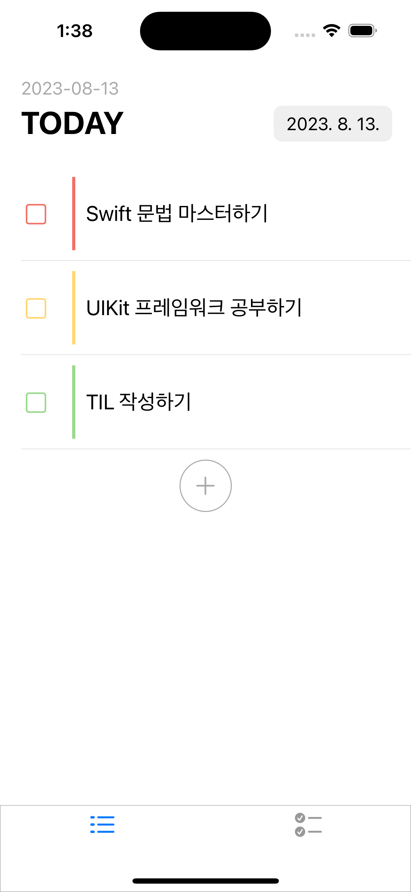
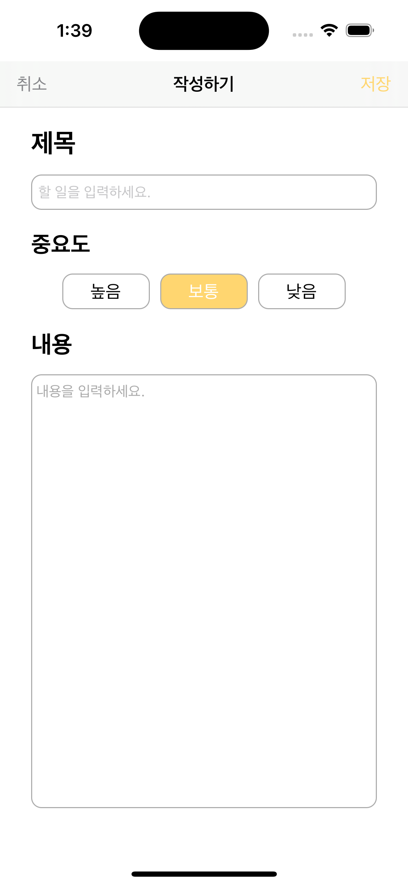
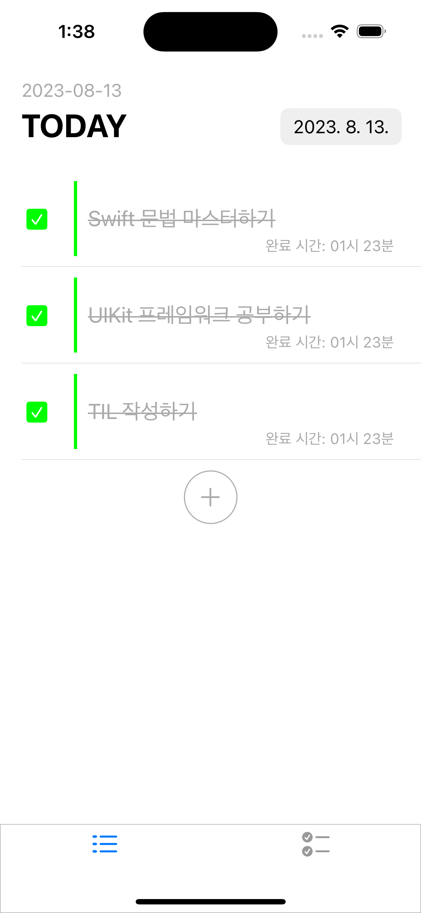
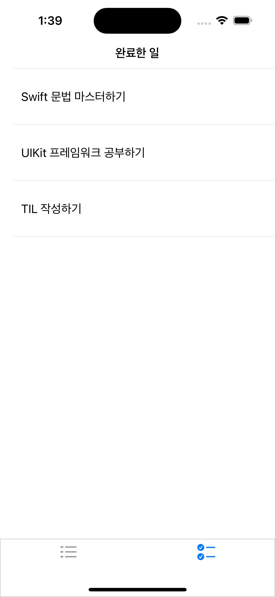

# nbc_week3_project
내일배움캠프 3, 5주차 프로젝트 - TodoApp 만들기

할 일을 생성하고 관리하는 Todo App 입니다.

## 5주차 필수과제

1. MVC 디자인 패턴으로 앱을 만들었습니다.
2. UserDefaults 를 활용해서 Create, Read, Delete 기능을 구현했습니다.
3. TableView 의 Section 을 카테고리 별로 나누고, header의 Title을 통해 Section을 구분할 수 있도록 했습니다.
4. 시작 화면에서 이미지의 URL을 통해 이미지를 불러오는 기능을 구현했습니다.

## 앱의 구조
디자인 패턴은 MVC(Model-View-Controller)를 적용했습니다.

## 주요 화면

	

		
		
		
		
	

